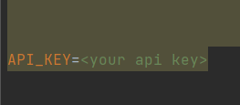

# tmdb-api

# description: a simple web app to download and save poster from tmdb in mongodb.

- requirements:
    - docker installed.
    - API key for imdb.
    - Code editor of your choice.
- steps to run:
    - Clone this repostory to your computer. 
      - after cloning you need to have a TMDB API you can follow the stepts below:
        - Go to https://www.themoviedb.org/ and create new account.
        - Go to settings and click on API.
        - Generate new API.
      - after you have the api save it in a .env file.
      - 
    - In the terminal run the command docker build . -t app:latest
    - Run the command docker-compose -f docker_compose.yaml up
    - open http://localhost:5001/ on your browser.
- the project:
    - This project ask the user to search for a movie poster and give him the poster for this movie.
    - All this project will be in container and I will use docker-compose to use also the image of mongoDB.
    - Build a simple web app that use a API for TMDB to download the posters.
